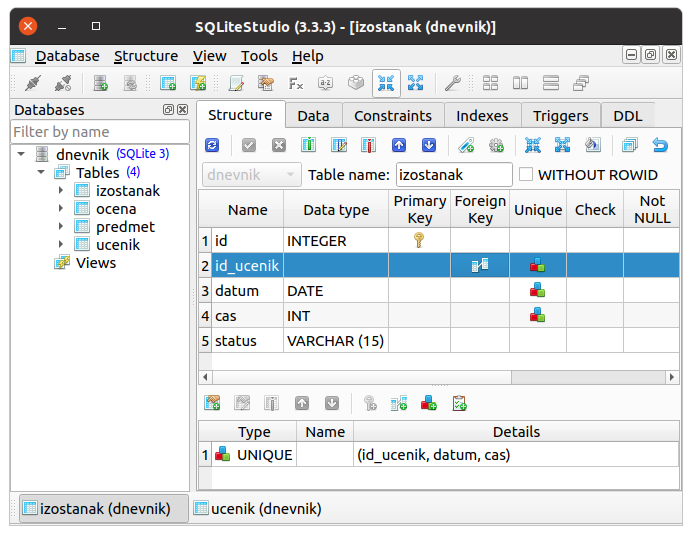

.. -*- mode: rst -*-

SQLite и SQLite Studio
----------------------

Као што смо рекли, постоји велики број што бесплатних, што
комерцијалних СУБП који се користе у развоју савремених апликација. У
наставку ћемо користити СУБП који се назива SQLite
(https://www.sqlite.org/). Ово је бесплатан софтвер, отвореног кода, који
је због једноставности коришћења и квалитета имплементације данас у најмасовнијој
употреби.

**Занимљивост.** Сваки *Android* и сваки *iPhone* телефон, сваки *Windows
10* или *Mac* рачунар, сваки *Firefox*, *Chrome* или *Safari* прегледач у
својој интерној имплементацији користе SQLite. У јуну 2021. године се
процењује да постоји преко :math:`10^{12}` SQLite база података које
се активно користе.

.. image:: ../../_images/sqlite.png
   :width: 220
   :align: center
   :alt: Логотип система SQLite

Начини интеракције са СУБП
..........................

Сваки СУБП подразумева неколико начина интеракције са својим
корисницима. Свакако најзначајнији је такозвани **апликативни
програмски интерфејс, АПИ** (енгл. application programming interface).
Њега користе програмери када из својих програма приступају базама
података. На пример, у склопу изучавања веб-програмирања коришћењем
програмског језика Python научићемо како се из Python програма
приступа SQLite базама података. Већ смо рекли да СУБП пре свега служи
да пружи услугу коришћења база другим програмима, па се СУБП заиста
најчешће користе путем АПИ. Ипак, приликом администрације базе
података (креирања и подешавање табела, подешавања корисничких налога
и права приступа подацима и слично), користе се специјализовани
административни интерфејси. Они могу бити било **команднолинијски
интерфејси, КЛИ** (енгл. command line interface, CLI), било **графички
кориснички интерфејси, ГКИ** (engl. graphic user interface, GUI). С
обзиром на то да је коришћење ГКИ удобније и једноставније, нарочито
за почетнике, у наставку ћемо бавити искључиво тим начином рада. Сам
систем SQLite не пружа ГКИ, међутим, постоји систем који се назива
SQLite Studio (https://sqlitestudio.pl/) који је бесплатан и који се
може једноставно преузети и користити.

Инсталација
...........

SQLite је веома необичан СУБП, по томе што се испоручује као
библиотека програмског језика, која се повезује са програмом који се
прави тако да програм сам у себи чува целокупан СУБП, док се база
података чува на диску, у једној јединој датотеци. Библиотека SQLite
за програмски језик Python постала је део стандардне библиотеке
Python-а, тако да ако имате иоле новију инсталацију језика Python,
није потребно ништа додатно инсталирати да бисте могли користити
SQLite.

Систем SQLite Studio (https://sqlitestudio.pl/) који пружа ГКИ за
администрирање SQL база података се може бесплатно преузети са веба и
инсталирати на разним оперативним системима.
  
