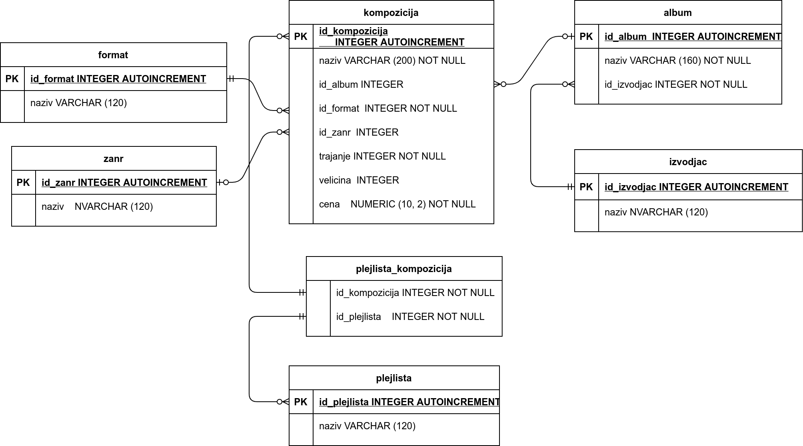

.. -*- mode: rst -*-

База компаније за продају песама
--------------------------------

У овом поглављу ћемо приказати дизајн једне базе података компаније за
продају музичких композиција (углавном песама). Ова база података је
преузета из туторијала за SQL доступног на адреси
https://www.sqlitetutorial.net/.

Јасно је да у бази морамо да чувамо податке о композицијама. За сваку
композицију знамо неке основне податке:
- назив
- трајање (у милисекундама)
- дигитални формат
- величина (у бајтовима)
- жанр
- цена 

Подразумеваћемо да је број жанрова ограничен и да жанр може да буде
само неки од унапред дефинисаних жанрова или да је композиција
евентуално неког непознатог жанра. Слично, подразумеваћемо и да је
дигитални формат неки од подразумеваних, при чему је формат сваке
композиције обавезно неки са те те листе (не може да буде непознат).

Свака композиција се налази на неком албуму и претпоставља се да није
могуће да се иста композиција нађе на два различита албума, али је
допуштено да неке композиције нису део ниједног албума. Албум,
наравно, може да садржи и више песама. Приметимо да се у опису
композиције не налази извођач. Наиме, претпоставља се да се на сваком
албуму налазе композиције само једног извођача и за сваки албум је
познат извођач. За сваког извођача je познато име. Поред тога, за
сваки албум је познат и назив албума.

У бази су дефинисане и листе композиција. Може постојати више
различитих листа и свака листа може садржати произвољан број песама.

Покушајмо да до сада изречене спецификацију преведемо у табеле
релационе базе. Размотримо ентитете и њихове односе.

Први ентитет који се јасно препознаје је *композиција*
(енгл. ``track``) и јасно је да морамо да оформимо табелу у којој се
чувају подаци о композицијама.  Претпоставићемо да поред атрибута који
природно описују композицију (``Name``, ``Milliseconds``, ``Bytes``,
``UnitPrice``) табела садржи и вештачки целобројни примарни кључ
(``TrackId``).

И *жанр* и *дигитални формат* (енгл. ``genre`` и ``media_type``) могу
бити посебни ентитети, који ће бити представљени посебним табелама у
којима ће бити набројани сви жанрови и сви подржани дигитални
формати. Претпоставићемо да се и у тим табелама налазе вештачки
целобројни примарни кључеви (``GenreId`` и ``MediaTypeId``). Свака
композиција има *нула или један* жанр, док сваком жанром припада *нула
или више* композиција. Ову везу можемо реализовати тако што ћемо у
табели композиција додати примарни кључ жанра (``GenreId``) који може
имати и недостајућу вредности. Свака композиција има *тачно један*
дигитални формат, док за сваки дигитални формат постоји *нула или
више* композиција тог формата. Ову везу можемо реализовати тако што
ћемо у табели композиција додати и примарни кључ дигиталног формата
(``MediaTypeId``), који не може имати недостајућу вредност. Колоне
``GenreId`` и ``MediaTypeId``) су страни кључеви у табели композиција.

И *албум* (енгл. ``album``) се јасно намеће као ентитет и чуваћемо
табелу у којој ћемо чувати све податке о албумима. Поред атрибута који
природно описују албум (назива албума ``Title``) претпоставићемо да
табела албума садржи и целобројни вештачки примарни кључ
(``AlbumId``). Свака композиција је на *нула или једном* албуму, а на
сваком албуму може постојати *нула или више* песама. Ову везу ћемо
реализовати тако што ћемо свакој песми придружити примарни кључ албума
``AlbumId``, који може имати недостајућу вредност. Колона ``AlbumId``
такође представља страни кључ у табели композиција.

Што се тиче извођача, за сваког извођача се памти само име, па би у
табели албума могло да стоји само име извођача, међутим, није
искључено да се у будућности додају још неки подаци о извођачима, а
није искључено ни да постоје два различита извођача истог имена, па
ћемо разматрати и ентитет *извођач* (енгл. ``artist``) и податке о
извођачима ћемо представљати у посебној табели. Поред атрибута који
природно описују извођача (``Name``) претпоставићемо да у табели
извођача памтимо и вештачки целобројни примарни кључ (``ArtistId``).
За сваки албум познат је *тачно један* извођач, док сваки извођач може
бити на *нула или више* албума. Ову везу ћемо остварити тако што ћемо
у табели албума памтити примарни кључ извођача ``ArtistId`` који не
сме имати недостајућу вредност. Колона ``ArtistId`` представља страни
кључ у табели албума.

Последњи ентитет који се јасно уочава је *листа композиција*
(енгл. ``playlist``). Оформићемо табелу у којој памтимо листе
композиција. Поред колона које природно описују листу (``Name``),
претпоставићемо да табела садржи и вештачки целобројни примарни кључ
(``PlaylistId``). Свака песма може бити укључена на нула или више
листа, док на свакој листи може бити нула или више песама. Одавде се
види да су песме и листе у односу *више-више* и она не може бити
једноставно реализована само коришћењем табела композиција и листа
песама. Зато ћемо оформити нови ентитет (``playlist_track``) тј. нову
табелу која ће служити да повеже композиције и листе. Она садржи
уређене парове (``PlaylistId``, ``TrackId``) и ниједна компонента тог
пара не може бити недостајућа. Тај пар је уједно и примарни кључ у тој
табели. Тиме смо везу више-више свели на две везе један-више.

На основу ове анализе добијамо следећи дијаграм базе.

Дефиниције табела су следеће.

.. code-block:: sql

   CREATE TABLE genre (
      GenreId INTEGER        PRIMARY KEY AUTOINCREMENT
                             NOT NULL,
      Name    VARCHAR (120) 
   );

   CREATE TABLE media_type (
      MediaTypeId INTEGER        PRIMARY KEY AUTOINCREMENT
                                 NOT NULL,
      Name        VARCHAR (120) 
   );

   CREATE TABLE artist (
      ArtistId INTEGER        PRIMARY KEY AUTOINCREMENT
                              NOT NULL,
      Name     VARCHAR (120) 
   );
   
   CREATE TABLE album (
      AlbumId  INTEGER        PRIMARY KEY AUTOINCREMENT
                              NOT NULL,
      Title    VARCHAR (160) NOT NULL,
      ArtistId INTEGER        NOT NULL,
      FOREIGN KEY ArtistId
      REFERENCES artists (ArtistId) ON DELETE RESTRICT
                                    ON UPDATE RESTRICT
  );

  CREATE TABLE track (
      TrackId      INTEGER         PRIMARY KEY AUTOINCREMENT
                                   NOT NULL,
      Name         VARCHAR (200)  NOT NULL,
      AlbumId      INTEGER,
      MediaTypeId  INTEGER         NOT NULL,
      GenreId      INTEGER,
      Composer     VARCHAR (220),
      Milliseconds INTEGER         NOT NULL,
      Bytes        INTEGER,
      UnitPrice    NUMERIC (10, 2) NOT NULL,
      FOREIGN KEY AlbumId
      REFERENCES albums AlbumId ON DELETE RESTRICT
                                ON UPDATE RESTRICT,
      FOREIGN KEY GenreId
      REFERENCES genres GenreId ON DELETE RESTRICT
                                ON UPDATE RESTRICT,
      FOREIGN KEY MediaTypeId
      REFERENCES media_types MediaTypeId ON DELETE RESTRICT
                                         ON UPDATE RESTRICT
  );

  CREATE TABLE playlist (
      PlaylistId INTEGER        PRIMARY KEY AUTOINCREMENT
                                NOT NULL,
      Name       VARCHAR (120) 
  );

  CREATE TABLE playlist_track (
      PlaylistId INTEGER NOT NULL,
      TrackId    INTEGER NOT NULL,
      CONSTRAINT PRIMARY KEY (
           PlaylistId,
           TrackId
      ),
      FOREIGN KEY PlaylistId
      REFERENCES playlists (PlaylistId) ON DELETE RESTRICT
                                        ON UPDATE RESTRICT,
      FOREIGN KEY TrackId
      REFERENCES tracks (TrackId) ON DELETE RESTRICT
                                  ON UPDATE RESTRICT
  );
  
