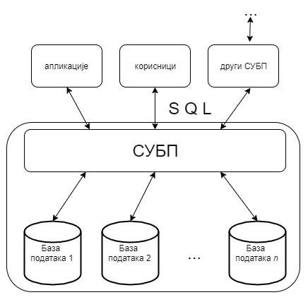

.. -*- mode: rst -*-

Базе података
=============

У ранијим разредима сте се упознали са значајем података у данашњем
свету и видели сте да се подаци често записују у табеларном облику.
Упознали сте се са програмима за табеларна израчунавања (Microsoft
Excel, Libreoffice Calc, ...), а видели сте и да се табеларно записани
подаци могу обрађивати и из програмских језика коришћењем
специјализованих библиотека (нпр. Pandas) и окружења (нпр. Jupyter).
Тиме се подаци обрађују много једноставније него када се читају из
обичних датотека и складиште у обичним низовима и матрицама.

Ипак озбиљне пословне апликације обично користе податке организоване 
на посебан начин, који између осталог омогућава бржи приступ и бољу 
прегледност, а који зовемо **база података**. Свака база података се 
формира и користи помоћу пратећег софтверског система који се назива 
**систем за управљање базама података, СУБП** (енгл. database management 
system, DBMS). Најпознатији системи за управљање базама података су:

- Oracle Database,
- MySql,
- Microsoft SQL Server,
- PostgreSQL,
- IBM DB2,
- Redis,
- SQLite итд.

Ти системи својим корисницима пружају све услуге рада са
подацима. Корисници СУБП су најчешће други програма тј. апликације (на
пример пословне, мобилне или веб-апликације), али и појединци који
директно анализирају податке (на пример, банкарски службеници који
анализирају пословање банке). Могућ је и сценарио у којима неколико
СУБП међусобно комуницирају тј. да један СУБП обезбеђује податке
другом.

Системи за управљање се брину о смештању података на начин
који обезбеђује:

- могућност што ефикаснијег приступа тим подацима у циљу њихове
  анализе, обраде и ажурирања,
- интегритет тих података (спречавају настанак грешака попут смештања
  неконзистентних и некоректних података).
- могућност истовременог коришћења података од стране већег броја
  корисника,
- могућност заштите приступа подацима и слично.
  
Корисници база комуницирају са СУБП коришћењем специјализованих језика
у којима формулишу захтеве (тзв. **упите**) на које СУБП
одговара. Најпознатији и најраспрострањенији такав језик је **SQL**
(енгл.  structured query language) и он је постао де факто стандард на
овом пољу.

Подела задужења између СУБП и програма који користи податке је таква
да програмери упите формулишу на веома апстрактном нивоу у односу на
имплементацију конкретног СУБП. То значи да програмери апликација које
користе базу не морају да се баве детаљима ефикасног смештања података
и алгоритмима приступа подацима, јер је СУБП тај који на основу упита
одређује најефикаснији начин да се тај упит изврши и да спољна
апликација добије податке које је захтевала. Упитни језици су
**декларативни**, што значи да се само описује који су подаци
потребни, а СУБП је тај који аутоматски одређује како је најбоље доћи
до тих података.

Професионални СУБП су у стању да чувају огромне количине података на
начин који омогућава великом броју корисника практично истовремено
коришћење тих података, често коришћењем разнородних рачунарских
система. На пример, централизовани електронски дневник на нивоу целе
Србије чува податке о стотинама хиљада ученика и милионима њихових
оцена тако да хиљаде наставника, ученика и родитеља имају практично
тренутни приступ жељеним подацима са својих рачунара, мобилних
телефона, таблета и слично.
