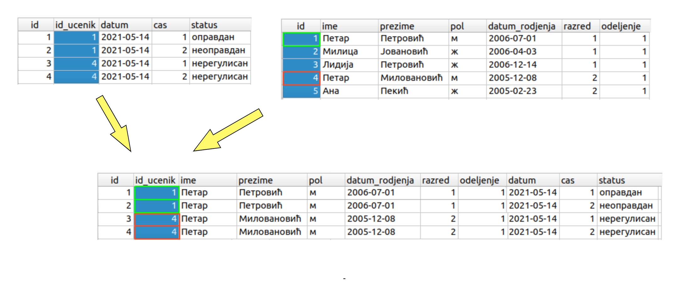
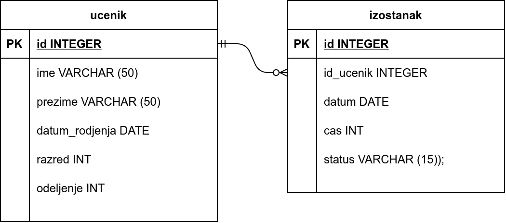
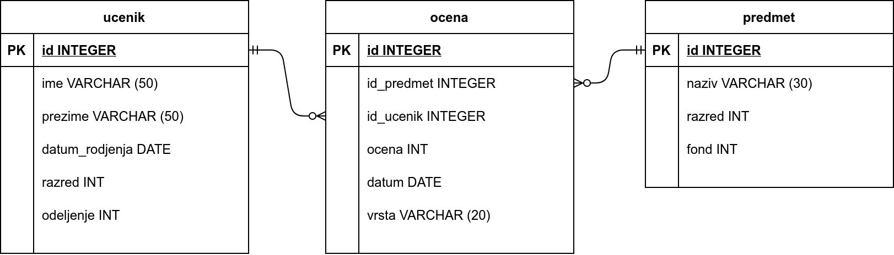

.. -*- mode: rst -*-

Табеларна организација података
-------------------------------

Најраспрострањенији модел представљања података у базама је
**релациони модел**, који подразумева да су сви подаци записани 
у табелама. Прецизније речено, ми у оквиру овог модела податке 
замишљамо као табелиране и у складу са тиме описујемо начин рада,
(а донекле и теоријске основе), док интерна репрезентација података
може да буде знатно сложенија, услед различитих оптимизација.

.. topic:: Зашто се овај модел зове релациони?

    Релација у математици се дефинише као скуп уређених н-торки. На пример,
    релација "бити дељив" на скупу {2, 3, 4, 5, 6} може да се представи као
    скуп уређених парова {(4, 2), (6, 2), (6, 3)}.
    
    Када н-торке које чине релацију запишемо једну испод друге, добијамо табелу.
    Редовима табеле одговарају н-торке које су у релацији. Стога се у базама 
    података термини **табела** и **релација** често користе као синоними. 
    
    .. csv-table::
       :header:  "дељеник", "делилац"
       :widths: 20, 80
       :align: left

       4, 2
       6, 2
       6, 3

    Јаку математичку основу савремених релационих база података поставио је
    Едгар Код (енгл. Edgar Codd) почетком 1970-их, кроз два формализма
    позната као **релациона алгебра** и **релациони рачун**.

Табеле имају своје **ћелије**, организоване у хоризонталне **врсте**
(**редове**) и вертикалне **колоне**.

На пример, наредна табела садржи податке о ученицима једне школе (у
првим примерима у овом поглављу бавићемо се готово искључиво базом у
којој се чувају подаци карактеристични за веома једноставан
информациони систем тј. електронски дневник једне средње школе).

.. csv-table::
   :header:  "id", "ime", "prezime", "pol", "datum_rodjenja", "razred", "odeljenje"
   :align: left

   1, Петар, Петровић, м, 2006-07-01, 1, 1
   2, Милица, Јовановић, ж, 2006-04-03, 1, 1
   3, Лидија, Петровић, ж, 2006-12-14, 1, 1
   4, Петар, Миловановић, м, 2005-12-08, 2, 1
   ..., ..., ..., ..., ..., ..., ...

Помоћу три тачкице наглашаваћемо да у табели постоји још података који
овде нису приказани.
   
Примећујемо да су појединачни ученици смештени по врстама, док свака
колона садржи неки посебан податак о ученицима:

- прва колона ``id`` садржи редни број ученика у табели,
- друга колона ``ime`` садржи име,
- трећа колона ``prezime`` садржи презиме,
- четврта колона ``pol`` садржи пол,
- пета колона ``datum_rodjenja`` садржи датум рођења,
- шеста колона ``razred`` садржи разред у који ученик иде и
- седма колона ``odeljenje`` садржи одељење ком ученик припада.

Оваква организација је карактеристична за све табеле у базама података
--- по врстама се складиште посебни **ентитети** (јединке, објекти),
док се по колонама складиште њихови **атрибути** (својства,
карактеристике).

Свака табела је одређена списком колона (атрибута) и типовима података
који се њима представљају. У претходном примеру редни број, разред и
одељење су *цели (природни) бројеви*, име и презиме су *текстуални
подаци* (ниске карактера), док је датум рођења податак специјалног
типа *датум*.

Свака ћелија садржи највише један податак (кажемо да су ћелије
**атомичне**) или је евентуално празна (садржи специјалну
**недостајућу вредност** ``NULL``), што нећемо често користити у овом
предмету. Ћелија, дакле, не може да садржи више података (низ
података, скуп података и слично). Пожељно је да подаци у свакој
ћелији буду заокружене, недељиве целине (на пример, уместо да име и
презиме ученика сместимо у једну колону, боље је да имамо засебне
колоне за име и презиме, јер је сасвим могуће да ће се неки упити
односити засебно на имена или на презимена ученика).

Примарни кључ
.............

Видећемо да је у базама јако важно да свака врста табеле садржи неки
податак (или групу података) на основу којих се та врста може
једнозначно идентификовати. Могло би се можда помислити да су у табели
ученика име и презиме ученика такви подаци, међутим, то није случај,
јер је сасвим могуће да два ученика чак и у истом одељењу имају исто
име и презиме. Свака особа у Србији се једнозначно може идентификовати
својим јединственим матичним бројем грађана и додавање ЈМБГ у нашу
табелу ученика би нам омогућило њихово једнозначно идентификовање на
основу ЈМБГ. Међутим, могуће је да не знамо ЈМБГ свих ученика или да
не желимо да такве поверљиве податке чувамо у нашој бази. Стога је у
приказаној табели ученика уведена прва колона, у којој се чува редни
број ученика. Пошто је јасно да свака врста (сваки ученик) има редни
број и да не постоје две врсте (два ученика) која имају исти редни
број, ова колона се може употребити као јединствени идентификатор
ученика. На пример, када се помене "ученик број 4", јасно је да се
ради о Петру Миловановићу, мушког пола, који је
рођен 8. децембра 2005. године и који иде у друго један одељење.

Због што ефикаснијег извршавања упита је важно да СУБП може веома брзо 
да нађе у табели ред који му је потребан. Да бисмо омогућили брзо 
проналажење редова, потребно је да означимо једну или више колона (података)
који својим садржајем једнозначно идентификују врсту у табели. Таква колона 
или група колона се назива **примарни кључ** те табеле.

Група свих колона једне табеле увек може да се употреби за једнозначно 
идентификовање сваке врсте у табели, тј. може да се сматра примарним кључем.
Међутим, то нема много смисла јер се помоћу таквог примарног кључа ништа не 
добија у брзини. У пракси се увек тежи да примарни кључ чини што мањи број колона, 
а најчешће је то једна колона.

Некада примарни кључ чине подаци који се већ налазе у табели. На
пример, у табели која садржи називе општина у Србији и њихов број
становника, назив општине може бити примарни кључ, јер не постоје две
општине које се исто називају.

.. csv-table::
   :header:  "opstina", "broj_stanovnika"
   :align: left

   Барајево, 26673
   Бачка Топола, 36213
   Вождовац, 162749
   Врачар, 56380
   ..., ...

У табели која садржи називе америчких градова, државе у којима се
налазе и њихов број становника, примарни кључ био пар који чине назив
града и назив државе. Наиме, назив града није довољан, јер је могуће
да постоје два града у две различите државе који се исто називају
(нпр. у чак 34 америчке државе постоји град који се зове Springfield).

.. csv-table::
   :header:  "grad", "drzava", "broj_stanovnika"
   :widths: 20, 30, 50
   :align: left

   Springfield, Illinois, 115888
   Springfield, Misouri, 462369
   Chicago, Illinois, 2713452
   ..., ..., ...

Некада су подаци који се намећу као примарни кључеви одређени
националним или међунарнодним стандардима. На пример, за
идентификовање особа у Србији користи се ЈМБГ, док се у Америци
користи тзв. SSN (social security number). За идентификовање места у
САД користи се ZIP код. За идентификовање књига користи се међународни
ISBN.

Са друге стране, подацима је увек могуће додати и вештачки одређен
примарни кључ. Као примарни кључ је увек могуће ставити и редни број
врсте у табели (специјална колона ``id``), као што је то урађено у
табели ученика. За разлику од претходних примера примарних кључева
који су на неки начин универзални (ЈМБГ, SSN, ZIP код, ISBN), вештачки
кључеви (редни број, односно id) су тесно везани за
нашу базу података и немају смисла ван ње. Уместо редног броја могуће
би било евентуално додати колону са јединственим корисничким именом
сваког ученика (које би они сами бирали и користили, на пример, за
логовање у апликацију), међутим, решење са нумеричким идентификатором
(редним бројем) је једноставније и универзалније.

Приликом дефинисања (формирања) табела у бази унутар СУБП, важно је 
нагласити које колоне чине примарни кључ. Користећи ове информације, 
СУБП интерно организује податке на такав начин да може много брже да 
приступи подацима на основу вредности примарног кључа, него када није
наглашено које колоне чине примарни кључ (уз нека додатна подешавања, СУБП
може брзо да присупа подацима и по садржају колона које нису кључне).

Када задамо примарни кључ, Систем осим бржег приступа подацима аутоматски 
обезбеђује да у табелу није могуће грешком унети две врсте које би имале 
исту вредност примарног кључа.

Повезане табеле и страни кључ
.............................

Размислимо како бисмо могли да табеларно представимо све изостанке
које је неки ученик направио током текуће школске године. За сваки
изостанак желимо да прикажемо што више детаља: који је датум у питању,
о ком се часу ради и који је статус тог изостанка (оправдан,
неоправдан, нерегулисан). Проширивање табеле ученика колоном за
изостанке не решава проблем, јер, као што смо већ рекли, у ћелијама те
колоне не можемо да истовремено чувамо податке о већем броју
изостанака. Ни додавање више колона није решење. Наиме, свака табела 
мора да има фиксиран број колона, па да бисмо покрили све случајеве, 
било би потребно онолико колона, колико је изостанака могуће направити.
Ово је врло нерационално коришћење ресурса, јер би ћелије у тим колонама 
биле углавном празне. Стога се просто намеће потреба за тим да
изостанке памтимо у посебној табели, где ће се у свакој врсти бележити
подаци тачно о једном изостанку. Поред наведених података о самом
изостанку, врста мора да садржи податке и о ученику који је тај
изостанак направио.

Први покушај једне такве табеле може бити следећи.

.. csv-table::
   :header: "id", "ime", "prezime", "datum", "cas", "status"
   :align: left

   1, Петар, Петровић, 2021-06-09, 1, оправдан
   2, Петар, Петровић, 2021-06-09, 2, оправдан
   3, Петар, Петровић, 2021-06-09, 3, оправдан
   4, Милица, Јовановић, 2021-06-09, 1, неоправдан
   ..., ..., ..., ..., ...

Међутим, овде постоји озбиљан проблем. Наиме, чим се у школи појаве
два ученика који имају исто име и презиме (што је сасвим реална
ситуација), постаје нејасно који је од тих ученика направио изостанак.
Зато делује да у табелу изостанака треба да додамо што више података о
ученику тј. све што о њему знамо.

.. csv-table::
   :header: "id", "ime", "prezime", "datum_rodjenja", "razred", "odeljenje", "datum", "cas", "status"
   :align: left

   1, Петар, Петровић, 2006-07-01, 1, 1, 2021-06-09, 1, оправдан
   2, Петар, Петровић, 2006-07-01, 1, 1, 2021-06-09, 2, оправдан
   3, Петар, Петровић, 2006-07-01, 1, 1, 2021-06-09, 3, оправдан
   4, Милица, Јовановић, 2006-04-03, 1, 1, 2021-06-09, 1, неоправдан
   ..., ..., ..., ..., ...

Овим смо само увели додатне проблеме, док главни проблем и даље
нисмо у потпуности решили. Наиме, иако је вероватноћа да се у неком
одељењу нађу два ученика који се исто зову и рођени су на исти дан
мала, она није у потпуности занемарива (а ми желимо да наша база
података буде исправна у свим могућим ситуацијама). Осим тога, примећујемо да се
многи подаци непотребно дуплирају. На пример, датум рођења ученика
наведен је уз сваки његов изостанак. Да смо памтили и имена родитеља
ученика, адресу становања и слично, ствар би била још неповољнија. Са
једне стране ово је неефикасно, а са друге стране уводи се могућност
грешке и нарушавања интегритета података (није јасно који је датум
рођења исправан, ако се уз истог ученика у две врсте нађу два
различита датума рођења).

Ако мало боље размотримо овај проблем, онда увиђамо да уз изостанак не
треба памтити све податке о ученику, већ само оне податке који нам
омогућавају да једнозначно одредимо о ком се ученику ради. На овом
месту увиђамо важност примарног кључа који смо увели, јер је у табели
изостанака за сваки изостанак довољно само упамтити примарни кључ
ученика који је направио тај изостанак. У нашем случају то је редни
број тј. јединствени идентификатор (вредност колоне ``id``) из табеле
ученика.

.. csv-table::
   :header: "id", "id_ucenik", "datum", "cas", "status"
   :align: left

   1, 1, 2021-06-09, 1, оправдан
   2, 1, 2021-06-09, 2, оправдан
   3, 1, 2021-06-09, 3, оправдан
   4, 2, 2021-06-09, 1, неоправдан
   ..., ..., ..., ..., ...

Приликом дефинисања оваквих табела у СУБП јако је важно нагласити да
су вредности у некој колони табеле примарни кључеви унутар
неке друге табеле. Каже се да колоне попут ``id_ucenik`` у табели
изостанака чине **страни кључ**. Дефинисањем страних кључева унутар
СУБП се може осигурати да није могуће да у табели изостанака постоји
изостанак који је придружен ученику који не постоји у табели ученика
(могуће је, на пример, аутоматски забранити да се обрише ученик из
табеле ученика док год постоје изостанци који су му придружени или да
се приликом брисања тог ученика из табеле ученика и сви његови
изостанци аутоматски избришу).

Иако се подаци о ученицима и изостанцима памте у одвојеним табелама,
те табеле се, ако је потребно, могу накнадно спојити тако да се сви
подаци појаве у истом приказу.

Табеле у бази и везе између њих се често представљају
дијаграмима. Једна врста дијаграма која се често користи приликом
пројектовања база података су **дијаграми ентитета и односа**
(енгл. entity-relationship diagram, ERD). На наредној слици је
приказан дијаграм који приказује ученике, изостанке и везу између њих
(што практично директно одговара табелама у нашој бази).

Приметимо да између ученика и изостанака постоји следећа веза: сваком
изостанку одговара тачно један ученик (који је направио тај
изостанак), док сваком ученику може да одговара нула или више
изостанака. Овај тип везе називамо веза
*један-према-више*. Најједноставнији начин да се у табелама базе
оствари веза један-према-више између две врсте ентитета је тај да се у
табелу којом се представља једна врста ентитета упише примарни кључ из
табеле којом се представља друга врста ентитета (тј. успостављањем
страног кључа). Још један пример везе *један-према-више* је веза
између ученика и одељења (сваком ученику одговара тачно једно одељење,
док сваком одељењу одговара више ученика). Пошто о одељењима не
памтимо никакве посебне податке, не постоји посебна табела са подацима
о одељењима. Са друге стране, табела ученика садржи колоне разред и
одељење, које заправо представљају примарни кључ одељења коме ученик
припада.

Електронски дневник, поред евиденције изостанака, мора да чува и
податке о оценама ученика. Пошто свака оцена припада неком предмету,
јасно је да у нашој бази желимо да чувамо и податке о предметима. Зато
ћемо да оформимо посебну табелу. За сваки предмет знамо назив, разред
у којем се предаје и недељни фонд часова. Назив предмета не може да
буде примарни кључ, јер се неки предмети предају у различитим
разредима (и са различитим фондом часова). Са друге стране, пар
(назив, разред) може да буде примарни кључ, међутим, једноставности
ради додаћемо посебно поље ``id`` у ком ћемо чувати вештачки уведен
јединствени идентификатор (редни број предмета у табели). Пример
садржаја табеле предмета је следећи.

.. csv-table::
   :header: "id", "naziv", "razred", "fond"
   :align: left

   1, математика, 1, 5
   2, математика, 2, 4
   3, српски језик, 1, 3
   4, биологија, 1, 2
   ..., ..., ..., ...

Рецимо и да је овај модел донекле упрошћен у односу на реалну
ситуацију у нашим средњим школама, јер се предмети могу предавати на
различитим смеровима и образовним профилима, са различитим фондом
часова, но моделовање реалног електронског дневника је компликованији
задатак, који превазилази овај предмет.

На крају размислимо и о томе како можемо да представимо оцене. Сваки
ученик може да има нула или више оцена, па се намеће да оцене памтимо
у посебној табели, где ће свака врста одговарати једној оцени. За
сваку оцену треба да знамо који ученик ју је добио, из ког предмета,
ког датума и која је врста те оцене (писмени задатак, контролни
задатак, одговарање, итд.). Веома слично као у случају изостанака, у
табели оцена је довољно само чувати примарни кључ табеле ученика,
тј. јединствени идентификатор ученика. Потпуно аналогно, довољно је да
у табели оцена чувамо само примарни кључ тј. јединствени идентификатор
предмета. Дакле, табела oцена може да има следећи садржај.

.. csv-table::
   :header: "id", "id_ucenik", "id_predmet", "ocena", "datum", "vrsta"
   :align: left

   1, 1, 1, 5, 2021-05-10, писмени задатак
   2, 2, 1, 3, 2021-05-10, писмени задатак
   3, 3, 1, 4, 2021-05-10, писмени задатак
   4, 4, 1, 4, 2021-05-10, писмени задатак
   ..., ..., ..., ..., ..., ...

Прва колона ``id`` је вештачки уведен примарни кључ тј. јединствени
идентификатор сваке оцене, док су колоне ``id_ucenik`` и
``id_predmet`` су страни кључеви у односу на колоне ``id`` у табелама
ученика и предмета.

Дијаграмом ентитета и односа, оваква организација базе се може
представити на следећи начин.

Између оцена и ученика постоји веза *један-према-више* (свакој оцени
одговара један ученик, док ученик може имати нула или више
оцена). Између оцена и предмета такође постоји веза *један-према-више*
(свакој оцени одговара тачно један предмет, док из сваког предмета
може постојати нула или више оцена). По раније описаном моделу, везе
један-према-више се реализују успостављањем страних кључева (што је и
урађено у табели оцена). 

Размислимо сада и о природи везе између одељења и наставника. Лако се
види да ова веза није *један-према-више*, јер типично сваком одељењу
предаје више наставника, а сваки наставник предаје у више
одељења. Зато овакав тип везе зовемо веза *више-према-више*. Овакву
врсту везе не можемо да остваримо помоћу једног страног кључа, као што
то радимо код везе *један-према-више*. На пример, није могуће у табелу
наставника уписати примарни кључ одељења, јер наставник може да
предаје у више одељења, па би за свако одељење била потребна по једна
колона. Већ смо видели да таква организација података није добра. Исто
тако, није могуће ни у табелу одељења уписати примарни кључ
наставника, јер одељењу предаје више наставника.

Везе *више-према-више* се обично реализују увођењем помоћне табеле
која садржи два страна кључа и остварује две везе
*један-према-више*. На пример, у случају наставника и одељења можемо
да уведемо табелу ``predaje``, која би садржала примарни кључ
наставника и примарни кључ одељења (заправо редни број разреда и редни
број одељења).

Наравно, исти прницип важи и у другим базама (не само у електронском
дневнику). На пример, у случају базе података која између осталог
садржи и податке о продаји одређених производа, веза између рачуна и
производа је такође *више-према-више*. Другим речима, на сваком рачуну
може да се појави више производа, а сваки производ може да се појави
на више рачуна. Зато се за евиденцију продаје уводи посебна табела за
ставке разних рачуна, а врсте те табеле садрже идентификатор рачуна и
идентификатор производа као стране кључеве.

Рецимо и да је могуће да се јави и веза *један-према-један* између две
врсте ентитета, али тада је заправо могуће се они представе
јединственом табелом, а да при томе не дође до непотребног дуплирања
података и ризика од нарушавања њиховог интегритета.
