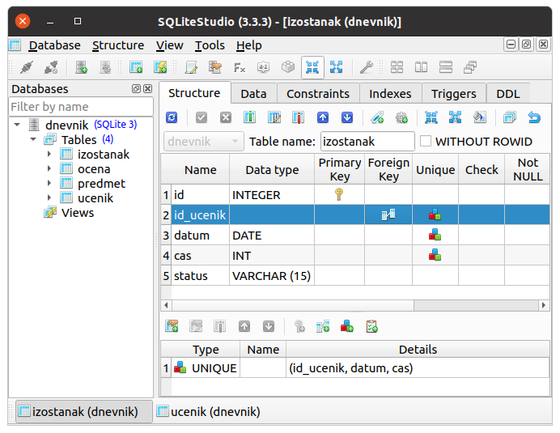

.. -*- mode: rst -*-

SQLite и SQLite Studio
----------------------

Као што смо рекли, постоји велики број што бесплатних, што
комерцијалних СУБП који се користе у развоју савремених апликација. У
наставку ћемо користити СУБП који се назива SQLite
(https://www.sqlite.org/). Ово је бесплатан софтвер, отвореног кода, који
је због једноставности коришћења и квалитета имплементације данас у најмасовнијој
употреби.

**Занимљивост.** Сваки *Android* и сваки *iPhone* телефон, сваки *Windows
10* или *Mac* рачунар, сваки *Firefox*, *Chrome* или *Safari* прегледач у
својој интерној имплементацији користе SQLite. У јуну 2021. године се
процењује да постоји преко :math:`10^{12}` SQLite база података које
се активно користе.

Систем SQLite целу базу података чува у једној датотеци, тј. за сваку базу 
података коју користимо имамо по једну датотеку. Ово је уобичајено решење 
и код других СУБП, мада постоје (тј. постојала су) и другачија решења.

Начини интеракције са СУБП
..........................

**Апликативни интерфејс**

Сваки СУБП подразумева неколико начина интеракције са својим
корисницима. Свакако најзначајнији је такозвани апликативни
програмски интерфејс, **АПИ** (енгл. application programming interface).
Њега користе програмери када из својих програма приступају базама
података. И ми ћемо (у склопу изучавања веб-програмирања коришћењем
програмског језика Python) показати како се из Python програма
приступа SQLite базама података. 

**Кориснички интерфејс**

Већ смо рекли да СУБП пре свега служи да пружи услугу коришћења база 
другим програмима, па се СУБП заиста најчешће користе путем апликативног 
програмског интерфејса. Ипак, АПИ није и једини начин коришћења базе 
података преко СУБП. Приликом администрације базе
података (креирања и подешавања табела, подешавања корисничких налога
и права приступа подацима и слично), користе се специјализовани
административни интерфејси. Они могу бити било **команднолинијски
интерфејси, КЛИ** (енгл. command line interface, CLI), било **графички
кориснички интерфејси, ГКИ** (engl. graphic user interface, GUI). С
обзиром на то да је коришћење ГКИ удобније и једноставније, нарочито
за почетнике, у наставку ћемо се бавити искључиво тим начином рада. Сам
систем SQLite не пружа ГКИ, међутим, постоји систем који се назива
SQLite Studio (https://sqlitestudio.pl/) који је бесплатан и који се
може једноставно преузети и користити.

Инсталација
...........

Да би наши програми преко АПИ могли да приступају бази, обично је потребно
да на рачунару имамо и апликацију која садржи СУБП и посредује у приступу 
бази. Међутим, програмски језик Python користи другачије решење за
приступ SQLite базама података. Комплетан SQLite СУБП је написан и као 
библиотека PySQLite програмског језика Python, тако да посредничка 
апликација није потребна. Више од тога, библиотека PySQLite је већ дуго део 
стандардне библиотеке Python-а. Захваљујући томе, ако имате инсталирану 
било коју верзију језика Python 3, није потребно ништа додатно инсталирати 
да бисте могли да користите SQLite (стандардна библиотека је инсталирана 
заједно са самим Python-ом).

Систем SQLite Studio (https://sqlitestudio.pl/) који пружа ГКИ за
администрирање SQL база података се може бесплатно преузети са веба и
инсталирати на разним оперативним системима.

Постоји и апликација која омогућава команднолинијски кориснички интерфејс 
за приступ SQLite бази, али у овом курсу нећемо користити ни ту аппликацију 
ни КЛИ.