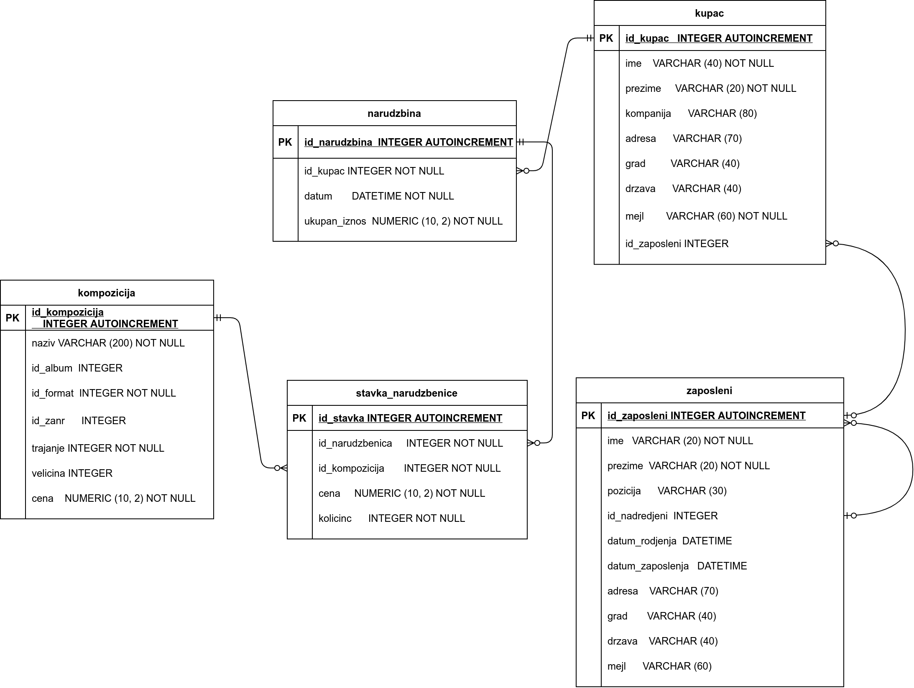

База компаније за продају дигиталних композиција -- подаци о продаји
--------------------------------------------------------------------

У претходном поглављу смо приказали организацију дела базе података
која се тиче композиција, албума, извођача и листа песама. У овом
поглављу ћемо надоградити ту базу података информацијама релевантним
за продају композиција. Кренимо од спецификације.

Спецификација
.............

У компанији постоји неколико запослених особа. За сваког запосленог
познати су следећи подаци:

- име, презиме
- титула тј. назив запослења
- датум рођења
- датум запослења
- адреса
- град
- држава/покрајина
- поштански кôд
- број телефона
- факс
- мејл

Запослени имају свог надређеног и на тај начин су организовани у
хијерархијску, дрволику структуру.

Чува се листа свих купаца. За сваког купца су познати следећи подаци.

- име, презиме
- компанија у чије име купује (ако не купује сам за себе)
- адреса
- град
- држава/покрајина
- поштански кôд
- телефон
- факс
- мејл

За купца може бити задужен неко од запослених (он му пружа комплетну
кориснчику подршку).

Корисници врше наруџбине и у склопу сваке наруџбине могу да наруче и
више композиција. За сваку наруџбину познати су следећи подаци.

- датум наруџбине
- адреса наплате
- град наплате
- поштански кôд наплате
- држава/покрајина наплате
- укупна цена наруџбине

За сваку наруџбину познат је и списак свих композиција на тој
наруџбини.

Превођење спецификације у табеле
................................

Јасно препознајмо врсту ентитета *запослени* (``Employee``), *купац*
(``Customer``) и наруџбеница (``Invoice``). Све ове врсте ентитета
ћемо представити табелама. Свакој од њих ћемо, поред атрибута који тај
ентитет природно описују, да придружимо по један вештачки целобројни
примарни кључ, односно ``Id``. Тиме добијамо почетну листу табела и
њихових колона (коју ћемо успут дорађивати):

- Табела ``Employee`` ће да садржи следеће колоне:
    - ``EmployeeId`` као примарни кључ
    - ``FirstName``, име запосленог
    - ``LastName``, презиме запосленог
    - ``Title``, титула тј. назив запослења
    - ``BirthDate``, датум рођења
    - ``HireDate``, датум запослења
    - ``Address``, адреса
    - ``City``, град
    - ``State``, држава/покрајина
    - ``Country``, земља
    - ``PostalCode``, поштански кôд
    - ``Phone``, број телефона
    - ``Fax``, факс
    - ``Email``, мејл адреса

- Табела ``Customer`` ће да садржи следеће колоне:
    - ``CustomerId`` као примарни кључ,
    - ``FirstName``, име купца
    - ``LastName``, презиме купца
    - ``Company``, компанија у чије име купује (ако не купује сам за себе)
    - ``Address``, адреса купца
    - ``City``, град
    - ``State``, држава/покрајина
    - ``Country``, земља
    - ``PostalCode``, поштански кôд
    - ``Phone``, број телефона
    - ``Fax``, факс и
    - ``Email``, мејл адреса.

- Табела ``Invoice`` ће да садржи следеће колоне:
    - ``InvoiceId`` као примарни кључ,
    - ``InvoiceDate``, датум наруџбине,
    - ``BillingAddress``, адреса наплате,
    - ``BillingCity``, град наплате
    - ``BillingState``, држава/покрајина наплате
    - ``BillingCountry``, земља наплате
    - ``BillingPostalCode``, поштански кôд наплате
    - ``Total``, укупна цена наруџбине.
  
Сваки запослени има *нула или једног* надређеног, а може бити
надређени за *нула или више* запослених. Дакле, постоји веза
*један-према-више* од ентитета запослени до њега самог, међутим, та
веза није ни по чему значајном различита од веза између два различита
ентитета. Ову везу можемо реализовати додавањем колоне ``ReportsTo`` у
табелу ``employee`` којој се чува примарни кључ запосленог (који може
бити и ``NULL``). Та колона је уједно страни кључ у односу на табелу
запослених.

Сваки купац може имати *нула или једног* запосленог који брине о њему,
док сваки запослени може имати *нула или више* купаца о којима
брине. Ова се веза може реализовати додавањем колоне ``SupportRepId``
у табели купаца ``customer`` која чува примарни кључ за њега задуженог
запосленог (та колона је страни кључ у односу на табелу запослених).

Свакој наруџбеници одговара *тачно један* купац, док сваки купац може
имати *нула или више* наруџбеница. Ову везу реализујемо тако што у
табели наруџбеница ``invoice`` додајемо колону ``CustomerId`` која
садржи примарни кључ купца (та колона је страни кључ у односу на
табелу купаца).

На крају, свака наруџбеница садржи нула или више композиција, док се
свака композиција може налазити на нула или више наруџбеница. Ову везу
типа *више-према-више* морамо реализовати креирањем посебне табеле
``invoice_item``.

- Табела ``invoice_item`` ће да садржи следеће колоне:
    - ``TrackId``, примарни кључ композиције,
    - ``InvoiceId``, примарни кључ наруџбенице,
    - ``Quantity``, број тих композиција које се наручују,
    - ``UnitPrice``, јединична цена те композиције у склопу те
      наруџбине (она може бити и различита у односу на тренутну
      јединичну цену те композиције).

SQL упити којима се креирају све наведене табеле и подешавају сви
наведени услови интегритета (примарни и страни кључеви, недостајуће
вредности) су следећи:

.. code-block:: sql

   CREATE TABLE employee (
      EmployeeId INTEGER       PRIMARY KEY AUTOINCREMENT
                               NOT NULL,
      LastName   VARCHAR (20) NOT NULL,
      FirstName  VARCHAR (20) NOT NULL,
      Title      VARCHAR (30),
      ReportsTo  INTEGER,
      BirthDate  DATETIME,
      HireDate   DATETIME,
      Address    VARCHAR (70),
      City       VARCHAR (40),
      State      VARCHAR (40),
      Country    VARCHAR (40),
      PostalCode VARCHAR (10),
      Phone      VARCHAR (24),
      Fax        VARCHAR (24),
      Email      VARCHAR (60),
      FOREIGN KEY (ReportsTo)
      REFERENCES employee (EmployeeId) ON DELETE RESTRICT
                                       ON UPDATE RESTRICT
   );

   CREATE TABLE customer (
       CustomerId   INTEGER       PRIMARY KEY AUTOINCREMENT
                                  NOT NULL,
       FirstName    VARCHAR (40) NOT NULL,
       LastName     VARCHAR (20) NOT NULL,
       Company      VARCHAR (80),
       Address      VARCHAR (70),
       City         VARCHAR (40),
       State        VARCHAR (40),
       Country      VARCHAR (40),
       PostalCode   VARCHAR (10),
       Phone        VARCHAR (24),
       Fax          VARCHAR (24),
       Email        VARCHAR (60) NOT NULL,
       SupportRepId INTEGER,
       FOREIGN KEY (SupportRepId)
       REFERENCES employee (EmployeeId) ON DELETE RESTRICT
                                        ON UPDATE RESTRICT
   );

   
   CREATE TABLE invoice (
       InvoiceId         INTEGER         PRIMARY KEY AUTOINCREMENT
                                         NOT NULL,
       CustomerId        INTEGER         NOT NULL,
       InvoiceDate       DATETIME        NOT NULL,
       BillingAddress    VARCHAR (70),
       BillingCity       VARCHAR (40),
       BillingState      VARCHAR (40),
       BillingCountry    VARCHAR (40),
       BillingPostalCode VARCHAR (10),
       Total             NUMERIC (10, 2) NOT NULL,
       FOREIGN KEY (CustomerId)
       REFERENCES customer ON DELETE RESTRICT
                           ON UPDATE RESTRICT
   );
   
   CREATE TABLE invoice_item (
       InvoiceLineId INTEGER         PRIMARY KEY AUTOINCREMENT
                                     NOT NULL,
       InvoiceId     INTEGER         NOT NULL,
       TrackId       INTEGER         NOT NULL,
       UnitPrice     NUMERIC (10, 2) NOT NULL,
       Quantity      INTEGER         NOT NULL,
       FOREIGN KEY (InvoiceId)
       REFERENCES invoice ON DELETE RESTRICT
                          ON UPDATE RESTRICT,
       FOREIGN KEY (TrackId)
       REFERENCES track ON DELETE RESTRICT
                        ON UPDATE RESTRICT
   );

Дизајн базе до којег смо дошли може да се прикаже и следећим дијаграмом:

   
