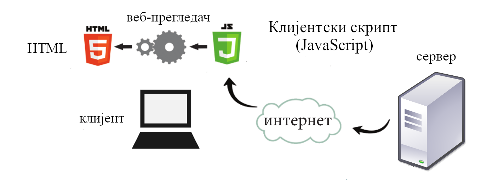
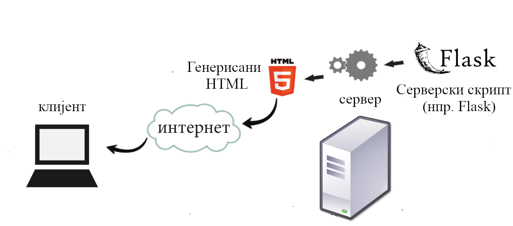

Серверске веб-апликације
========================

Веб је од самог свог зачетка заснован на моделу
**клијент-сервер**. Клијент (то је најчешће веб-прегледач било на
рачунару, било на неком мобилном уређају) се обраћа веб-серверу са
**захтевом** за одређеним ресурсима: веб-странама, сликама, звучним и
видео-записима, документима, датотекама и слично. Сервер **одговара**
на захтев клијента и, ако је све у реду, шаље клијенту тражени ресурс.
Протокол на основу којег се врши комуникација између клијента и
сервера назива се протокол за пренос хипертекста **HTTP**
(енгл. **HyperText Transfer Protocol**).

.. image:: ../../_images/http_zahtev_i_odgovor.png
   :width: 600
   :align: center
   :alt: Праћење HTTP комуникације из прегледача Google Chrome

Статичке веб-стране
...................
         
На почетку развоја веба, веб-стране је углавном чинио само унапред
припремљен садржај који су корисници могли само да прегледају и
евентуално прате везе ка другим странама. Такве стране се називају
**статичке веб-стране** и оне не омогућавају никакву нарочиту
интеракцију са корисницима. Сваки корисник приликом приступа таквој
веб-страни види потпуно исту страну, може само да чита њен садржај и
након тога да пређе на неку другу страну (најчешће праћењем неког
линка унутар стране). У овом случају, и клијент и сервер имају веома
једноставне улоге: клијент шаље захтев серверу, сервер проналази
статичку страну у свом систему датотека и враћа је клијенту без икакве
обраде. На крају клијент приказује добијену страну и ту се сва
интеракција извршава, све до наредног захтева.

Веб је напредовао за кратко време, па се појавила потреба за
напреднијим обликом интеракције са корисницима, за шта је било
потребно основне веб-технологије (језике за обележавање HTML и CSS)
допунити напреднијим програмским језицима који се користе за
програмирање овакве интеракције. У зависности од тога да ли се
програми извршавају на клијентском или серверском рачунару,
разликујемо клијентске и серверске веб-технологије.

Активне стране (клијентски скриптови)
.....................................

Прошле године смо се упознали са језиком **JavaScript** који је
омогућио да се са сервера на клијент поред статичног садржаја
форматираног помоћу језика HTML и CSS достави и текст програма
(тзв. скрипта) у језику JavaScript који се затим извршава унутар
прегледача. Пошто се такви скриптови извршавају на клијенту, они се
називају **клијентски скриптови**. Стране које садрже JavaScript
називају се некада и **(интер)активне стране**.

На наредној слици је приказан принцип рада клијентског скрипта. Скрипт
се доставља са сервера на клијент (уклопљен у HTML страну), а затим га
прегледач извршава и извршавањем његових команди модификује отренутно
отворену веб-страну.

         
Програми у језику JavaScript су најчешће вођени догађајима,
тј. JavaScript нам најчешће служи да дефинишемо измене на страни које
се дешавају као реакције на акције корисника (нпр. када корисник у
апликацији за претрагу летовања мишем кликне на поље за унос датума,
онда се на страни прикаже календар из којега онда бира
датум). Видећемо у наставку да се JavaScript данас често користи и да
се као реакција на неку акцију корисника затраже неки подаци са
сервера и да се, када стигну са севера, прикажу у склопу тренутно
отворене веб-стране.

Динамичке стране (серверски скриптови)
......................................

Данас вебом доминирају **динамичке веб-стране** чији се садржај или
део садржаја креира аутоматски, као резултат рада одређених програма
(кажемо скриптова). Ти скриптови се покрећу на серверу (зато се
називају **серверски скриптови**), обично читају неке податке из базе
података (која се такође налази на неком серверу на вебу) и на основу
прочитаних података формирају веб-страну која се онда шаље клијенту
који је приказује. Дакле, у случају клијентских скриптова сервер
клијенту шаље страну која садржи програмски кôд скрипта (у језику
JavaScript) који се онда извршава на клијенту, док се у случају
серверских скриптова, ти скиптови (написани на језицима какви су
Python, PHP, ASP.Net итд.) изврше на серверу и на клијент се шаље
резултат њиховог извршавања (скрипт никада не стигне до клијента и
клијент нема увид у његов кôд). 

На наредној слици је приказан принцип рада серверских
скриптова. Скрипт се извршава на серверу (самостално или у склопу
неког ширег, вебсерверског софтвера, какав је нпр. Apache) и формира
се HTML страница која се шаље клијенту. Рад клијентских скриптова је
могућ и без интернета (прегледач може да отвори локално складиштену
веб-страну која садржи клијентски скрипт).

Наравно, динамички генерисане веб-стране могу у себи да садрже и неке
клијентске скриптове и на данашњем вебу се обично креирају
веб-апликације које комбинују и серверске и клијентске скриптове.

Клијентска страна веб-апликације понекад се назива **предња страна**
(**frontend**), а серверска страна понекад се назива **задња страна**
(**backend**). Програмери се често специјализују за писање клијентских
или серверских скриптова, па се због тога одговарајућа занимања по
огласима за посао именују као **frontend web developer** и **backend
web developer**. Програмер који истовремено пише и серверске и
клијентске скриптове се назива **full-stack web developer**.

AJAX
....

Традиционални модел веба подразумева да сервер и клијент комуницирају
једино тако што клијент шаље серверу захтев за потпуно новом веб
страном, која се, када стигне, приказује у прегледачу веба, уместо
стране која је претходно била приказана. Међутим, с временом се развио
друачији механизам који подразумева да клијент и сервер комуницирају и
док је једна веб-страна отворена, размењујући одређене
податке. Илуструјмо ово кроз неколико примера.

На пример, претраживачи често нуде опцију аутоматског предлагања упита
(енгл. autocomplete). Када корисник унесе неколико почетних карактера
у поље за претрагу, сервер клијенту шаље неколико најчешћих упита који
почињу тим карактерима и ти упити се уписују у падајућу листу из које
се могу одабрати. Даље, на пример, када нов мејл стигне док је
отворена нека веб-мејл апликација, он се интегрише у списак свих
мејлова већ приказан на тој веб-страни. Када се кликне на неки мејл,
његов садржај се тек тада преузима са сервера и приказују у тој
јединственој страни веб-апликације. Слично, све апликације за онлајн
четовање (ћаскање) раде тако што се поруке шаљу серверу, а онда их
клијенти примају са сервера и приказују унутар тренутно отворене
стране (без отварања нове). Даље, на пример, када корисник отвори
дигиталну мапу света, са сервера му стигну мапе (слике) које приказују
обично његов град или земљу на одређеном нивоу увећања. Када затим
мишем помери мапу или промени ниво увећања, са сервера стижу нове
слике које се приказују у оквиру исте странице, на месту старих. На
споријим везама се може приметити и да се детаљније информације (имена
насељених места, путева, река и слично) такође учитавају са
сервера. Када се кликне на неко интересантно место, тада се са сервера
преузимају неке детаљније информације и неке фотографије тог места и
приказују се у "облачићу".

Дакле, док је страна отворена, oбично након неких акција корисника
(уноса текста у поље за унос текста, акција мишем и слично) или у
правилним временским интервалима (на пример, на сваких неколико
секунди), клијент шаље серверу захтев за одређеним подацима (не целом
новом веб-страном). Реакција на акције корисника и слање таквог
захтева и прихват одговора се врше из клијентског скрипта (из језика
JavaScript). Када одговор стигне, онда се (поново помоћу језика
JavaScript) он интегрише у тренутно отворену веб-страну (без њене
замене другом веб-страном). Оqвај начин рада се назива **Ajax**
(*Asynchronous JavaScript and XML*). Разлог је то што су некада подаци
са сервера ка клијенту стизали у формату *XML*, док се данас јако
често користи формат *JSON* (*JavaScript Object Notation*). Овај начин
рада смањује активности сервера, а повећава активности клијента, што у
доба веома моћних клијентских дигиталних уређаја (чак и мобилних)
смањује трошкове рада сервера са пуно корисника. Ajax клијентима
доноси осећај бржег и одзивнијег рада (јер се избегава учитавање и
приказ страна из почетка приликом сваке промене дела садржаја). С
временом се развио чак и концепт **једностраничних апликација**
(енгл. *single page application*), где целокупна веб-апликација има
једну једину страну чији се садржај мења помоћу Ajax-а. Пошто Ajax
подразумева и веома сложено програмирање клијентских скриптова (у
језику JavaScript), развијене су многе библиотеке и радни оквири који
су намењени за то (данас су веома популарни **Angular** компаније
Google и **React.js** компаније Facebook).
