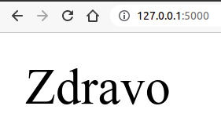

Први програм, рутирање
----------------------

Свака иоле сложенија веб-апликација укључује неколико различитих
датотека, па је логична конвенција да се све оне чувају унутар једног
директоријума (једне фасцикле) намењеног тој
веб-апликацији. Направићемо стога директоријум под именом ``01_hello``
и у њему ћемо креирати датотеку ``app.py`` следеће садржине.

.. literalinclude:: /../_src/01_hello/app.py
    :language: python

Након тога, у командној линији се постављамо у директоријум у коме смо
креирали датотеку ``app.py`` и покрећемо Flask апликацију командом
``flask run``. Ако је све у реду, добићемо поруку

::
   
   * Environment: production
     WARNING: This is a development server. Do not use it in a production deployment.
     Use a production WSGI server instead.
   * Debug mode: off
   * Running on http://127.0.0.1:5000/ (Press CTRL+C to quit)

То значи да је наша апликација покренута на локалном рачунару и да јој
се може приступити из прегледача веба преко адресе
``http://127.0.0.1:5000/``. Када се оде на ту адресу, види се страница
која садржи само текст ``Zdravo``. Наш веб-сервер све време ради у
позадини, а можемо га прекинути комбинацијом тастера ``Ctrl + C`` у
командој линији у којој је покренут.

На слици је приказан изглед странице унутар прегледача веба.

**Ко жели да зна више?** IP адреса ``127.0.0.1`` је специјална и
означава приступ локалном веб-серверу тј. приступ веб-серверу који је
тренутно покренут на локалном рачунару на ком је покренут и прегледач
веба из ког се приступа овој адреси. Уместо ове нумеричке адресе,
понекад се користи и ознака ``localhost``. Број ``5000`` означава
тзв. порт који ближе одређује да желимо да приступимо баш Flask
серверу тј. Flask веб-апликацији коју смо покренули. Наиме, могуће је
да на локалном рачунару ради више веб-сервера истовремено, па се
портовима прецизно одређује којем од њих се приступа. Број ``5000`` је
одређен прилично произвољно и у оквиру подешавања Flask апликације је
могуће променити га (ако се, на пример, покаже да је на порту 5000 већ
покренута нека друга веб-апликација).

Анализирајмо сада изворни кôд ове једноставне апликације. Напоменимо
да је назив ``app.py`` подразумеван назив за главну датотеку Flask
апликације (то може и да се промени, али у првим примерима то нећемо
радити). Свака Flask апликација је у програму представљена објектом
klase ``Flask``. По обичају, тај објекат именујемо именом ``app`` и
конструишемо га позивом тзв. конструктора ``Flask(...)``, коме ћемо
увек проследити вредност специјалне променљиве ``__name__`` (значење
овог параметра нема потребе да објашњавамо детаљно). Дакле, свака
Flask апликација ће почињати кодом следећег облика

.. code-block:: py

   from flask import Flask
   
   app = Flask(__name__)

Путање (руте)
*************
   
Главни део Flask апликације чине функције чији је задатак да када се
позову врате садржај веб-стране тј. да врате текст који ће се
проследити назад, прегледачу веба, тј. клијенту који је послао захтев
за веб-страницом. Која ће од тих функција бити позвана, зависи од
самог захтева тј. зависи од URL-а који је коришћен за приступ нашој
веб-апликацији (он је део HTTP захтева којим се приступа нашој
апликацији). Flask врши тзв. **рутирање** тј. анализира захтев и на
основу тога позива неку од дефинисаних Python функција. Да би функција
била повезана са одређеним обликом захтева (тј. URL-a) потребно је пре
њене дефиниције навести тзв. декоратер ``@app.route(...)``. У приказаном
примеру, декоратером ``@app.route("/")``, функција ``index`` је
повезана са захтевом облика ``"/"``, што значи да ће та функција бити
позвана када се наведе адреса нашег веб-сајта, без икавких додатних
путања унутар URL-a (кажемо да је ово адреса корена нашег
веб-сајта). То значи да ће функција ``index`` бити позвана ако се
Flask апликација покрене на локалном рачунару помоћу ``flask run``
(без постављања на неки сервер на интернету), и ако се у прегледачу
откуца URL адреса ``http://127.0.0.1:5000/``. Исто би се десило и ако
би се наша апликација поставила на интернет, на пример на домен
``www.moja-prodavnica.com`` и ако се би се у прегледачу навела адреса
``http://www.moja-prodavnica.com`` или адреса
``http://www.moja-prodavnica.com/``. Да је испред функције наведено
``@app.route("/index.html")``, функција ``index`` би била повезана са
URL-ом ``http://127.0.0.1:5000/index.html`` тј. URL-ом
``http://www.moja-prodavnica.com/index.html``.

Пошто функција ``index`` враћа ниску ``Zdravo``, то је одговор који се
шаље назад прегледачу и који се приказује.

Испред сваке функције је могуће навести и више различитих ``route``
декорација, чиме се та функција повезује са свим наведеним путањама.

Веб-апликација обично одговара на захтеве више различитих путања. У
наредном примеру се дефинишу две функције, при чему се првој од њих,
функцији ``home()``, придружују путање ``/``, ``/index.html`` и
``/home``, што значи да ће се приликом посета адресама
``http://127.0.0.1:5000``, ``http://127.0.0.1:5000/index.html`` или
``http://127.0.0.1:5000/home`` у прегледачу приказати текст ``Home``.
Другој функцији (функцији ``about()``) придружена је путања
``/about``, што значи да ће се посетом адреси
``http://127.0.0.1:5000/about`` у прегледачу приказати текст
``About``.

.. literalinclude:: /../_src/01b_hello_routes/app.py
    :language: python

.. mchoice:: 01_flask_rutiranje
   :answer_a: @app.route("about")
   :answer_b: @app.route("/about")
   :answer_c: @app.route("5000/about")
   :answer_d: @app.url("/about")
   :correct: b

   Којом декорацијом треба декорисати функцију која ће се позвати када
   се унесе URL ``http://127.0.0.1:5000/about``?

.. mchoice:: 01_flask_funkcije
   :answer_a: податак типа ``bool`` и то ``True`` ако је све у реду тј.
              ``False`` ако је дошло до неке грешке
   :answer_b: нумеричку ознаку статуса захтева (нпр. 404 - page not found)
   :answer_c: не враћа ништа, него садржај странице која је одговор на захтев
              треба да испише помоћу функције ``print``
   :answer_d: ниску карактера која представља садржај стране која се
              шаље са сервера на клијент
   :correct: d

   Функције које одговарају на HTTP захтеве враћају:
   
