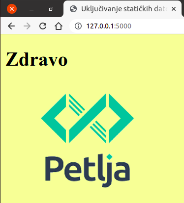

Укључивање статичких датотека (CSS стилови, слике, ...) и линкови
-----------------------------------------------------------------

Од раније знамо да веб-стране често укључују и неке датотеке (слике,
видео и аудио записе, CSS датотеке и слично). Чак и када су у питању
динамичке веб-стране (оне које су настале као рад неког серверског
скрипта), те датотеке су **статичке** тј. сачуване су негде на серверу
и на клијент се испоручују у неизмењеном облику. Поставља се питање
како у склопу Flask веб-апликације организовати те датотеке по
директоријумима. Иако се HTML датотеке налазе у поддиректоријуму
``templates`` (заправо у директоријуму ``templates`` налазе се шаблони
на основу којих се гради HTML који се шаље као одговор клијенту),
обичај је да се све статичке датотеке налазе у посебном
поддиректоријуму ``static``. На пример, тај директоријум може садржати
CSS датотеку ``style.css`` и слику ``logo.png``. Тада је садржај
директоријума веб-апликације следећи.

::

   .
   ├── app.py
   ├── templates
   │   └── index.html
   └── static
       ├── style.css
       └── logo.png

Приликом укључивања статичких датотека у HTML (тј. у шаблон на основу
којег се гради HTML) није довољно навести само назив датотеке (јер се
она не налази у истом директоријуму као HTML датотека тј. шаблон), а
не препоручује се ни навођење ни релативних ни апсолутних
путања. Уместо тога, постоји посебна функција библиотеке ``flask`` под
називом ``url_for`` која служи за аутоматско одређивање URL-ова. Ако
је први аргумент функције ``url_for`` ниска ``'static'``, а други,
именовани аргумент ``filename='f'``, где је ``f`` назив датотеке,
функција враћа исправну путању до датотеке ``f`` у директоријуму
``static``. Приметимо да за запис ниски користимо апострофе, зато што
за запис вредности HTML атрибута ``src`` користимо двоструке
наводнике.

Прикажимо сада шаблон ``index.html`` у коме се у заглављу укључује CSS
датотека ``style.css`` (из поддиректоријума ``static``), а у телу се
укључује слика ``logo.png`` (такође из поддиректоријума ``static``).

.. literalinclude:: /../_src/08_hello_url_for/templates/index.html
    :language: html+jinja

Након обраде шаблона, добија се следећа HTML страна.

.. code-block:: html

   <!DOCTYPE html>
   <html>
      <head>
        <title>Uključivanje statičkih datoteka</title>
        <meta charset="utf-8" />
        <link rel="stylesheet" href="/static/style.css" />
      </head>
      <body>
        <h1>Zdravo</h1>
    
        
      </body>
   </html>                

На слици је приказан изглед странице унутар прегледача веба.
   

   
Приметимо да је функција ``url_for`` за датотеке из директоријума
``static`` генерисала URL путање ``/static/style.css`` и
``/static/log.png``. Апликација би исправно радила и да су URL-ови
одмах били написани на овај начин, али то се не препоручује (увек је
боље користити функцију ``url_for``).

Још једна препоручена употреба функције ``url_for`` је за креирање
веза (линкова) ка другим странама Flask веб-апликације. Наиме, увек је
линк могуће направити навођењем апсолутне или релативне путање до
жељене странице, међутим, пошто се путање могу мењати током одржавања
сајта, препоручује се да се URL-ови тј. путање аутоматски одреде
коришћењем функције ``url_for``. На пример, претпоставићемо да сајт
има страницу ``Home``, која се добија позивом Python функције
``home()`` у датотеци ``app.py``, и страницу ``About``, која се добија
позивом Python функције ``about()`` у датотеци ``app.py``.

Навигационе линкове у шаблону ``index.html`` (који се наслеђује и који
је заједнички за све веб-стране на сајту) можемо направити на следећи
начин:

.. literalinclude:: /../_src/11_url_for/templates/index.html
    :language: html+jinja

Питања и задаци за вежбу
........................

.. questionnote::

   Коришћењем спољашње CSS датотеке стилизуј веб-страну која садржи
   таблицу множења (она је описана у лекцији о шаблонима).

.. fillintheblank:: flask-static-1

   Слике које се укључују у динамичке веб-стране које се граде помоћу
   библиотеке Flask би требало да се налазе унутар директоријума:

   - :static: Тачно
     :x: Покушај поново
