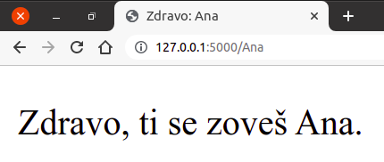

Пренос података коришћењем рутирања
***********************************

У случају методе GET, видели смо како се подаци са клијента на сервер
преносе у склопу URL-а. Структуру URL-а у циљу преноса података је
могуће искористити и на другачији начин, коришћењем Flask рутирања.
Наиме, путање које се користе за рутирање не морају бити константне
(као што смо до сада видели). На пример, ако приликом рутирања
наведемо путању облика ``"/<ime>"``, то значи да ће анотирана функција
бити позвана када год се наведе путања тог облика, при чему ће јој оно
што следи иза косе црте бити прослеђено као параметар.

.. literalinclude:: /../_src/05_hello_route_params/app.py
    :language: python

Ако се овом скрипту приступи преко URL-а ``http://127.0.0.1/Petar``,
биће позвана функција ``pozdravi("Petar")``, а ако се приступи преко
URL-а ``http://127.0.0.1/Ana``, биће позвана функција
``pozdravi("Ana")``. Податак о имену је, дакле, извучен из URL-а,
прослеђен функцији и надаље се слободно може користити. На пример,
можемо га проследити шаблону који садржи HTML опис стране која
поздравља корисника са тим именом.

.. literalinclude:: /../_src/05_hello_route_params/templates/index.html
    :language: html+jinja

На слици је приказан изглед стране унутар прегледача веба.
   

               
Да смо путању навели у облику ``"pozdravi/<ime>"``, поздравној страни
би се приступало преко URL-ова облика
``http://127.0.0.1/pozdravi/Petar``.

Могуће је и ограничити формат неког податка. На пример, ако желимо да
проследимо нумерички идентификатор производа, можемо у склопу путање
навести да прихватамо само целе бројеве тј. податке типа
``int``. Путања би тада могла бити
``"prikazi_proizvod/<int:id_proizvod>"``. Овим странама би се тада
приступало преко URL-а облика
``http://127.0.0.1/prikazi_proizvod/1234``
тј. ``http://www.moja-prodavnica.com/prikazi_proizvod/1234``, под
претпоставком да смо наш сајт поставили на интернет и повезали га са
доменом ``www.moja-prodavnica.com``.

Приметимо да овај начин прослеђивања података даје мало лепши облик
URL-ова него када се користи метод GET, међутим, основна мана је што
се, за разлику од метода GET и POST, не слаже аутоматски са
формуларима.
